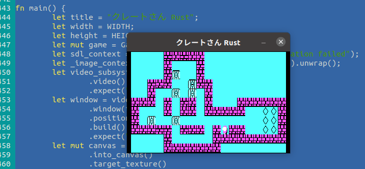

_Archived repository -- All development has moved here : https://github.com/nsauzede/cratesan_

# クレートさん (CrateSan, or MrCrate)
A tribute to Sokoban by Thinking Rabbit, made in [Rust](Rust) and [V](V) languages, using SDL2 for multimedia.



# Try it
In Rust :
```
$ cd Rust
$ cargo run
```

In V :
```
$ cd V
$ v run cratesan.v
```

# Controls
- Arrows to move the player
- Return to proceed to next level, when current is won
- "R" to restart level

# Credits
All the levels are Copyright Thinking Rabbit, downloaded from this [URL](https://www.sourcecode.se/sokoban/levels?act=dnl_text&file=Original.slc).
